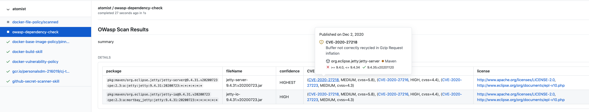

# `atomist/owasp-dependency-check`

Scan Clojure projects using [OWasp Dependency Check](https://owasp.org/www-project-dependency-check/).

By default, detect pushes to repositories containing either a leiningen or clojure-tools project.  Scan the project
dependencies and create a GitHub CheckRun with the scan results.

This creates consistent checks across all of your Clojure repos.  Our next step is to roll out policies for managing
changes to vulnerabilities, and to notify code owners when new vulnerabilities impact production code.

As part of enabling this check, users be asked to install a GitHub app in their organization.  This app enables the
creation of github check runs and notifications when a new commit is ready to be scanned.

---

Created by [Atomist][atomist]. Need Help? [Join our Slack workspace][slack].

[atomist]: https://atomist.com/ "Atomist - How Teams Deliver Software"
[slack]: https://join.atomist.com/ "Atomist Community Slack"
